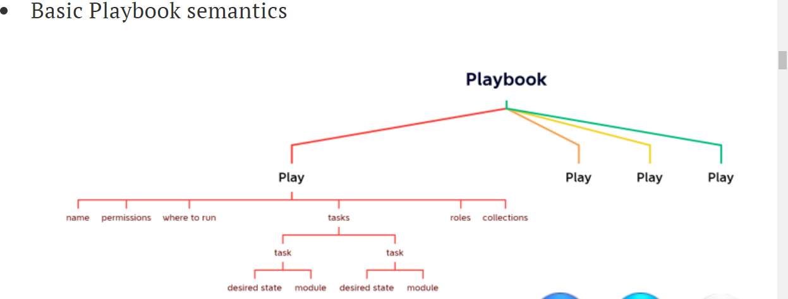
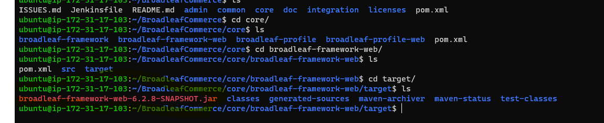
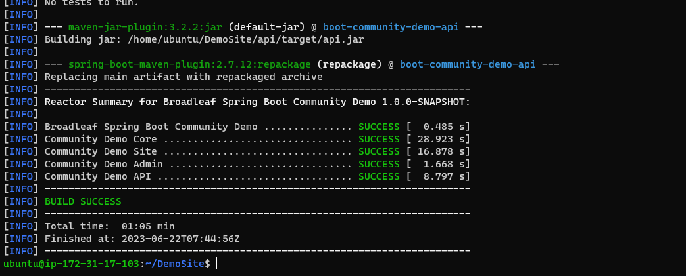

### ANSIBLE
* Vm-1(node)
* Sudo apt update
Sudo adduser hema
For redaht ( sudo passwd <adduser name>)

Sudo vi /etc/ssh/sshd_config
Sudo vi /etc/sudoers
Sudo systemctl restart sshd
Su hema
Ssh <privateip>
vm-2(master)
Sudo apt update
Sudo adduser hema
Sudo vi /etc/ssh/sshd_config
Sudo vi /etc/sudoers
Sudo systemctl restart sshd
Su hema
sudo apt update
sudo apt install software-properties-common
sudo add-apt-repository --yes --update ppa:ansible/ansible
sudo apt install ansible -y
ansible --version
Ssh-keygen
Ssh-copy-id hema@<privateip> ( ssh rrr@172.31.0.194)
Exit 
Echo <private-ip> > inventory
Cat inventory
ansible -i inventory -m ping all
pwd(/home/useradd)
Vi hosts  (enter private ip of node)
Vi <.yaml>
Ansible-playbook -i hosts –sysntax-check <name.yaml>

### ansible facts

all nodes ping information stored in the master this is called ansible facts

* ansible -m setup -i hosts all

* ansible -m setup -i hosts -a 'filter=*ansible_os_family*' all

* cat /etc/os-release 
### to find the operatin system type

### write playbooks to install the following on ubuntu 22.04
java 17
.net 7
nginx

### Handlers: running operations on change

* Sometimes you want a task to run only when a change is made on a machine.

For example:
 you may want to restart a service if a task updates the configuration of that service, but not if the configuration is unchanged. Ansible uses handlers to address this use case. Handlers are tasks that only run when notified.

 ### Inventory
Inventory in Ansible represents the hosts which we need to connect to.

Ansible inventory is broadly classified into two types

* static inventory:
 where we mention the list of nodes to connect to in some file

* Static inventory can be mentioned in two formats

            * ini 
<https://en.wikipedia.org/wiki/INI_file#:~:text=An%20INI%20file%20is%20a,sections%20that%20organize%20the%20properties.>

            * yaml
<https://github.com/asquarezone/AnsibleZone/commit/9dd91ff1e6d12bd912927737f8f445a3284a39bf>

* dynamic inventory: 
where we mention some script/plugin which will dynamically find out the nodes to connect to

### install Broadleaf application
 
* install openjdk-17-jdk and maven
* git clone https://github.com/BroadleafCommerce/BroadleafCommerce.git
* cd BroadleafCommerce
* mvn package -Dmaven.test.failure.ignore=true

* /BroadleafCommerce/core/broadleaf-framework-web/target/broadleaf-framework-web-6.2.8-SNAPSHOT.jar

* /BroadleafCommerce/core/broadleaf-profile-web/target/broadleaf-profile-web-6.2.8-SNAPSHOT.jar

* 

* if you want to removedirectory with lot of folders we use
        <rm -r -v < folder name >>
### OR 
* git clone https://github.com/BroadleafCommerce/DemoSite.git
* cd Demosite

* cd site

* and you want to run application using below command

* mvn spring-boot:run

### how to install shopizer

* install java-11 and maven

* git clone https://github.com/shopizer-ecommerce/shopizer.git

* $ cd shopizer

* mvnw clean install

* cd sm-shop

* mvnw spring-boot:run

* http://publicip:8080/swagger-ui.html

###  Facts

* ansible collects information about the node on which it is executing by the help of module called as setup

* Ansible playbook by default collects information about nodes where it is executing, we can use this with the help of variables

* Collecting information can be disabled as well

---
- name: do some thing
  hosts: all
  gather_facts: no
  ...
  ...
---

* In the playbook the facts will be collected and will be available in a special variables " ansible_facts " as shown in the below play book

---
- name: facts will be available
  hosts: all
  become: no
  tasks:
    - name: print OS details
      ansible.builtin.debug:
        msg: "hemachaitanya"
        var: ansible_default_ipv4
    - name: same info
      ansible.builtin.debug:
        var: ansible_facts["default_ipv4"]
---

* conditional reference for ansible playbook

<https://docs.ansible.com/ansible/latest/playbook_guide/playbooks_conditionals.html>

* 

