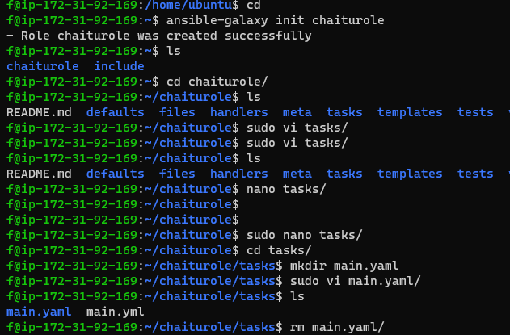
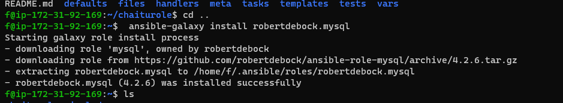
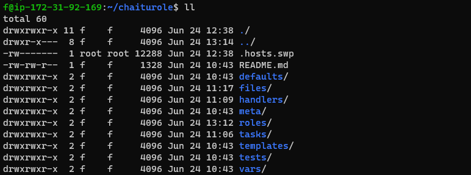

### Here is a basic Ansible playbook example to delete a specific user. The playbook will be executed on the target hosts to remove the desired user.

#### Step 1: Create the Playbook

Create a file called delete_user.yml for your Ansible playbook.

```yaml
- name: Delete a specific user on multiple hosts
  hosts: all
  become: true
  vars:
    user_to_delete: "username"  # Replace 'username' with the actual username to delete

  tasks:
    - name: Check if the user exists
      ansible.builtin.shell: id {{ user_to_delete }}
      register: user_check
      ignore_errors: true

    - name: Delete the user if it exists
      ansible.builtin.user:
        name: "{{ user_to_delete }}"
        state: absent
      when: user_check.rc == 0

    - name: Remove user's home directory (optional)
      ansible.builtin.file:
        path: "/home/{{ user_to_delete }}"
        state: absent
      when: user_check.rc == 0
```
      
#### Step 2: How It Works
hosts: all: This indicates that the playbook will run on all hosts defined in your Ansible inventory.

become: true: Elevates privileges to root to allow user deletion.

vars: This defines a variable user_to_delete, which you can set dynamically or hardcode for a specific user.

id {{ user_to_delete }}: This checks if the user exists on the system.

ansible.builtin.user: If the user exists, this task deletes the user.

ansible.builtin.file: This optionally deletes the user's home directory.

### Step 3: Run the Playbook

To run the playbook, use the following command, replacing username with the actual user to delete:


     ansible-playbook delete_user.yml -e "user_to_delete=username"

[link of alla commands](https://dev.to/prodevopsguytech/terraform-commands-from-beginner-to-advanced-for-devops-engineers-17n5)

*Here are some essential Ansible commands for a DevOps engineer* :
```

_*Inventory Management*_

1. `ansible-inventory` - Manage inventory files
2. `ansible-inventory --list` - List all hosts in the inventory
3. `ansible-inventory --host <hostname>` - Show detailed information about a host

_*Playbook Execution*_

1. `ansible-playbook <playbook_name>.yml` - Run a playbook
2. `ansible-playbook --list-tasks <playbook_name>.yml` - List all tasks in a playbook
3. `ansible-playbook --start-at-task <task_name> <playbook_name>.yml` - Start executing a playbook from a specific task

_*Ad-Hoc Commands*_

1. `ansible <host_pattern> -m <module_name>` - Run an ad-hoc command
2. `ansible <host_pattern> -m command -a "<command>"` - Run a command on a host
3. `ansible <host_pattern> -m shell -a "<command>"` - Run a shell command on a host

_*Module Management*_

1. `ansible-doc <module_name>` - Show documentation for a module
2. `ansible-doc -l` - List all available modules
3. `ansible-galaxy <module_name>` - Install a module from Ansible Galaxy

_*Role Management*_

1. `ansible-galaxy install <role_name>` - Install a role from Ansible Galaxy
2. `ansible-galaxy list` - List all installed roles
3. `ansible-galaxy remove <role_name>` - Remove a role

_*Other*_

1. `ansible --version` - Show Ansible version
2. `ansible-config` - Manage Ansible configuration files
3. `ansible-vault` - Manage encrypted variables and files

```
* What is Ansible, and what are its key features?
* 
How do you configure Ansible and nodes in a network environment?

Can you explain the concept of a playbook in Ansible?

What is configuration management, and how does Ansible facilitate it?

What is an inventory in Ansible, and how is it used?

Please explain the difference between static and dynamic inventory in Ansible.

What is Ansible Vault, and how is it used to secure sensitive information?

What is a Jinja template, and what is the difference between a template and a Jinja template in Ansible?

Which modules do you commonly use in your organization when working with Ansible?

Can you explain the concepts of roles, tasks, and handlers in Ansible?

How do you configure group inventory in Ansible?

What are modules in Ansible, and how are they used?

Can you provide an overview of Ansible Collections and their significance?

How do you pass values dynamically when running a playbook in Ansible?

###  What is Ansible? 

* Ansible is one of the configuration Management Tools. It is a method through we automate system admin tasks. 

* Configuration refers to each and every minute details of a system. If we do any changes in system means we are changing the configuration of a machine.
* That means we are changing the configuration of the machine.

* All windows/Linux system administrators manage the configuration of a machine manually. 
* All DevOps engineers are managing this configuration automatic way by using 
some tools which are available in the market.

* One such tool is Ansible. That’s why we call Ansible as 
configuration management tool

## ansible 

* ansible is a configuration management tool & default pip3 also installed with ansible

* master: ansible , salt 

* nodes: agent , (chef and puppet)

###  Working process of Ansible? 

* Here  we  crate  file  called  playbook  and  inside  playbook  we  write  script  in  YAML  format  to  create 
infrastructure.

* Once we execute this playbook, automatically code will be converted into 
Infrastructure.  
* We  call  this  process  as  IAC  (Infrastructure  as  Code).

* We  have  open  source  and enterprise editions of Ansible. Enterprise edition we call Ansible Tower.

### The architecture of Ansible? 

* #### Server: – 
It is the place where we create playbooks and write code in YML format 

* #### Node: – 
It is the place where we apply code to create infrastructure. Server pushes code to nodes.

* #### Ssh: – 
It is an agent through ansible server pushes code to nodes.  

* #### Setup: – 
It is a module in ansible which gathers nodes information.  

* #### Inventory file:-
 In this file we keep IP/DNS of nodes. 
 ###  Advantages of Ansible over other SCM (Source Code Management) tools?  
• Agentless  
• Relies on “ssh”  
• Uses python  
• Push mechanism 

### What do you mean by Ad-Hoc commands in Ansible?

* These are simple one liner Linux commands we use to meet temporary requirements without actually saving for later. Here we don’t use ansible modules.
 * So there, Idempotency will not work with Ad-Hoc commands.
* If at all we don’t get required YAML module to write to create infrastructure, then we go for it.
* Without using playbooks, we can use these Ad-Hoc commands for temporary purpose.  

###  Differences between Chef and Ansible?  
• Ansible - chef 

• Playbook – Recipe  ( play means collection of tasks )

• Module – Resource  ( )

• Host – Node  

• Setup – Ohai  ( maintaines the node information)

• Ssh – Knife 

• Push-Pull

###  Mention some list of sections that we mention in Playbook? 

play book is a collection of tasks . 
which can be writting in yaml formate .
yaml is nothing but data representation language , basically it have key:value pairs in yaml.

  #### 1. Target section
  * In this section, we mention the group name which contains either IP addresses or Hostnames of nodes.
    * When we execute playbook, then code will be pushed too all nodes which are there in the group that we mention in Target section.
    * We use “all” key word to refer all groups.

 #### 2. Task section
 
 * These tasks are specific to that specific playbook and can't be shared with other playbooks.
 *  This is something you should use roles for.
   
 * All tasks we mention in this task section. We can mention any no of 
modules in one playbook. 
* There is no limit. 
* If there is only one task, then instead of going with big playbook, simply we can go with arbitrary command where we can use one module at a time.
 * If more than one module, then there is no option except going with big playbook.

#### 3. Variable section
  We have this concept in each and every programming language and scripting language. We use “vars” key word to use variables.  
#### 4. Handler section

Sometimes you want a task to run only when a change is made on a machine.
  

### configuration management
* In configuration management is to automate the admin tasks what we do manually

* We can increase uptime so that can provide maximum user satisfaction.

* Improve the performance of the system
* Ensure compliences
* prevent errors as tools won't any error
* Reduce cost
#### configuration management are devided into two types

Direction of Communication

PULL => Node to CM server
    * Chef
    #### chef:
    (1)  Managed/Hosted  chef.
    (2)  Graphical user interface , it's not free
    (3) We can launch one server and we need to install chef server package. It is completely free 
package. It’s CLI (Command Line Interface).
    * Puppet
Push => CM Server to Node
List of nodes (inventory)
    * Ansible
    * SaltStack


* (1) push based configuration management
* (2) pull based configuration management

### Ansible commands 


```text

ansible --version

ansible -m ping all

ansible all --list-hosts

ansible all -m command -a "uptime"

ansible all -i inventory_file -m png

ansible-playbook -i <inventaryfile/path> --syntax-check </playbook/path>

ansible webservers -m ping

ansible all -m command -a "ls /var/log"

ansible all -m shell -a "echo $TERM"

ansible all -m copy -a "src=/etc/hosts dest=/tmp/hosts"

ansible all -m file -a "path=/tmp/test mode=600 state=touch"

ansible all -m ping -vvv

ansible all -m ping --private-key=~/.ssh/private_key

ansible-vault create secret.yml

ansible-vault encrypt secret.yml

ansible-vault decrypt secret.yml

ansible-vault edit secret.yml

ansible-vault view secret.yml

ansible-playbook playbook.yml --ask-vault-pass

ansible-playbook playbook.yml --ask-vault-pass


```yaml
- hosts: webservers
  vars:
    http_port: 80
  tasks:
    - name: Ensure Apache is installed
      yum:
        name: httpd
        state: present
```

ansible-playbook playbook.yml -e "http_port=80"

ansible-playbook playbook.yml --ask-pass

ansible-playbook playbook.yml --ask-become-pass

ansible-playbook playbook.yml -u username --ask-pass

ansible-playbook playbook.yml -b --become-user=root --ask-become-pass

ansible-galaxy init role_name

ansible-galaxy init role_name

ansible-galaxy list

ansible all -m ping -u username

ansible all -m ping -b


```
###  What is Idempotency? 

#### idempotence: 
Run this once or n times you will have same result

* It won’t do the same task again and again.
* If any new changes are there in that code, then only chef-client is going to take action. 
* So it doesn’t make any difference ever if you run chef-client any no of times. 
* So tracking the system details to not to reapply changes again 
and again, we call Idempotency

#### Desired state: 
We express configuration to acheive a desired state.

### configuration drift:
    * difference between desired state and actual state 

###  Why are we using loops concept in Ansible? 

```yaml
---
- name: Install packages
  hosts: all
  become: yes

  vars:
    packages_to_install:
      - apache2
      - mysql-server
      - php

  tasks:
    - name: Install packages
      package:
        name: "{{ item }}"
        state: present
      loop: "{{ packages_to_install }}"
```


* you want to create at a time 

* Sometimes  we  might  need  to  deal  with  multiple  tasks. 
* For  instance,  Installing  multiple  packages, Creating  many  users,  creation  many  groups. 
   Etc.  In  this  case,  mentioning  module  for  every  task  is 
complex process.
 * So, to address this issue, we have a concept of loops.
  * We have to use variables in combination with loops.

### stats module

```yaml
---
- name: Gather statistics
  hosts: all
  tasks:
    - name: Task 1
      command: echo "Task 1 executed successfully."
      register: task1_result

    - name: Task 2 (intentionally fails)
      command: /bin/false
      ignore_errors: true
      register: task2_result

    - name: Task 3
      command: echo "Task 3 executed successfully."
      register: task3_result

    - name: Update statistics
      stats:
        increment: "{{ 'task_' + item.result | default('failed') }}"
      loop:
        - "{{ task1_result }}"
        - "{{ task2_result }}"
        - "{{ task3_result }}"

```

*  When we re-execute ansible playbook some modules are executing un-necessarily lets stop that from happening 

### modules:
  module is nothing but executes statistcal scripts

### Reusable Assets in Ansible

  #### * Ansible playbooks can be reused directly
  #### import_playbook module

              import module nothing but when we want to install or build some application , dependent component one playbook is placed in  another place , we apply that dependet playbook first prerequisite (or)check first that play book only its exits after application starts o run.

      * Includes a file with a list of plays to be executed.

      * Files with a list of plays can only be included at the top level.

      * You cannot use this action inside a play.

  #### include_playbook module

            Includes a file with a list of tasks to be executed in the current playbook.

    * Lists of tasks can only be included where tasks normally run (in play).

    *   Before Ansible 2.0, all includes were ‘static’ and were executed when the play was compiled.

    * Static includes are not subject to most directives. For example, loops or conditionals are applied instead to each inherited task.
    
  #### roles:

### Why Ansible Roles?

   * To create ansible role by using these below command

    <ansible-galaxy init <role_name>>



   * To install role by using these below command

   < ansible-galaxy install robertdebock.mysql>




Roles play an important part in breaking the complex Ansible Playbooks, the core component of any Ansible configuration, into easy to reuse multiple files. 
* With Ansible Roles you can:

* Bundle automation content and make it reusable

* Group multiple sets of tasks in an effective manner

* Modify and reduce syntax errors

* Release modules independent of Ansible Core releases

* Ansible Roles are equivalent to modules in Puppet and Cookbooks in Chef.


### README.md  defaults  files  handlers  meta  tasks  templates  tests  vars

* README.md – This is the Readme file for the role. Put the detailed information of all the input parameters for the role and example yml in the readme file.

* tasks - You can enlist all tasks to be executed by the Role in tasks. Main.yml of the tasks is the entry point for the Role (this is where the execution starts). One can include other files into this file.

* handlers - Contains handlers, which may be used by this role or even anywhere outside this role.

* defaults - Default variables for the Role.

* vars - Other variables which are of more priority than the defaults for Role.

* files - This contains the files which can be deployed via Role.

* templates - Contains templates which can be deployed via Role.
 #### templet vs jinga templets

 * to write dynamic values is called jinga templet(./j2)

* meta - You can define metadata for the Role in meta. Other Role dependencies, if any, should be mentioned in this file.

* tests – CI tests to be executed.

* library - Embedding Modules and Plugins in Roles (Not created by init command). If required one can define custom module in python in this folder and use it in the tasks.

### The ‘ansible-galaxy’ commands

The ‘ansible-galaxy’ command comes bundled with Ansible. You can create, install, and remove Roles using commands. It can be used for the following 



#### actions:

 * Init: 
 A Role requires various directories and main.yml files. Using the init command you can initialize the base structure of a new Role and save the time required to create directories and files.

* Info:
 With the info command you can see more details about a specific Role.

* Install:
 You can download and install Roles from the Galaxy website using the install command. (Works similar to ‘pip install’ in python)

* List:
 Use list to show the name and version of each Role installed in the roles_path. (Works similar to ‘pip freeze’ in python).

* Remove:
 Use remove to delete a Role from roles_path.

### Ansible Collections

* Ansible collections are distribution format which include roles and modules

#### Collections:
* collections are a distribution format for Ansible content that can include playbooks, roles, modules, and plugins. You can install and use collections through a distribution server, such as Ansible Galaxy, or a Pulp 3 Galaxy server.

### ansible valut:

      [ansible@controller base]$ ansible-vault edit --vault-id password_file secret.yml

* is used to encripted the data (valut used for security purpose)

### What is a Jinja template, and what is the difference between a template and a Jinja template in Ansible?


### How do you pass values dynamically when running a playbook in Ansible?

      ansible-playbook -i <vars.yaml> <nginx.yaml> -e <var_name>=<.....>

### 
